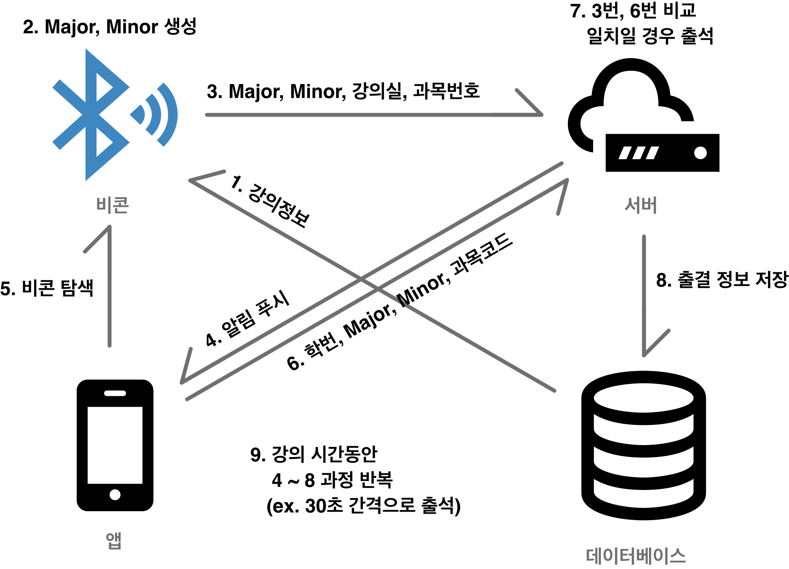

# iBeacon을 활용한 전자출결 시스템

#### 기술스택
&nbsp;
&nbsp;
 
&nbsp; 
&nbsp; 
 
&nbsp;
&nbsp; 
&nbsp; 

#### 개발자들
|이름|Github|
|:---:|:---:|
|이호준||
|김정현||
|이재진||

## 개요
iBeacon을 활용한 전자출결 시스템.
저전력 블루투스 기술을 사용하는 비콘을 활용, 비콘이 HTTP 통신을 통해 데이터베이스에서 해당 강의실의 실시간 강의 목록을 파악하여 강의가 있을 경우 해당 강의 수강생들의 스마트폰으로 푸시알림을 보내어 스마트폰에서 주변의 비콘을 검색, 비콘에 설정된 Major, Minor값을 읽어들여 서버로 HTTP통신하여 전송.
수강생의 스마트폰에서 보낸 Major, Minor값이 서버 내 저장된 비콘의 Major, Minor값과 일치할 경우 출석으로 처리.

 

## 주요기술
BLE

기기간 Master, Slave 관계를 형성하여 통신하는 기존 Classic Bluetooth의 경량화 버전을 목표로 블루투스 4.0의 일부로 발표된 BLE는 훨씬 적은 전력으로 Classic Bluetooth와 비슷한 수준의 통신을 할 수 있게 한 기술이다.

iBeacon

실내 측위 시스템을 위한 애플의 등록상표로, 주변 Bluetooth 4.0 통신이 가능한 기기들에게 자신의 위치를 알릴 수 있는 새로운 형태의 저전력, 저비용의 전파발신 장치이다.

## 프로젝트 목표

### 기존 전자출결 시스템의 단점
동아대학교에서 사용하고 있는 '동아대학교 전자출결'에는 몇가지 단점이 존재한다.
1. 교수 - 학생 스마트폰간의 블루투스 통신을 이용하기 때문에 출석이 한번에 이뤄지지 않는 경우가 빈번하고, 교수자는 결석인원이 발생하면 항상 이중으로 출석을 확인해야하는 번거로움이 존재한다.
2. 출석 과정이 끝난 후 도망가는(일명 출튀) 학생을 교수자가 일일히 확인하고 관리하기 힘들기 때문에 출석점수에 대한 공정성 문제가 일어날 수 있다.
3. 교수자가 임의로 10분 이내로 지각한 학생들은 출석으로 처리해주겠다 라고 하였어도 정말 학생이 10분 내의 시간으로 지각을 했는지에 대해 판단할 기준근거가 없다.
4. 교수자가 출석을 위해 항상 스마트폰을 휴대하여야 한다.

### 프로젝트를 통해 기존 단점을 해결할 수 있는 방법
해당 프로젝트는 강의실 내 설치된 비콘이 강의 목록을 확인하여 강의가 있을경우 비콘이 직접 출석과정을 진행하기 때문에 교수자가 직접 출석과정을 진행하지 않아도 되며, 비콘이 강의가 있는동안 단위시간마다 출석과정을 반복하기때문에 지각자에 대한 처리, 출석하고 도망가는 학생에 대한 출결 처리 등 명확한 판단의 기준을 세울 수 있으며, 강의 시간 내 수십번의 출석과정을 진행하기때문에 블루투스 또는 서버와의 HTTP 통신에 실패하여 강의시간 중간에 출석이 제대로 되지 않았더라도 해당 시간의 앞 뒤 시간동안의 출석을 확인하여 출결에 대한 보정을 진행할 수 있다.

## 서비스의 작동방식
아두이노에서 서버와 HTTP통신을 하여 현재 시간에 강의가 있는지를 판별한다. 
현재 시간에 강의가 있을 경우 아두이노는 출석 프로세스를 시작하며, 비콘을 초기화하고 비콘에 Major, Minor값을 랜덤하게 설정하여 그 값을 서버로 통신하여 DB에 등록한다. 
Major, Minor값이 등록되고나면 아두이노에서 출석을 요청한 강의정보를 서버로 보내 해당 강의의 출석 시작을 요청하고, 서버에서 해당 과목의 수강생들 휴대폰에 푸시 알림을 보내어 출석과정을 시작한다. 학생의 스마트폰은 서버에서 넘어온 강의실의 UUID를 기준으로 주변의 비콘 탐색을 시작하며, UUID가 일치하는 비콘을 찾았을 때 해당 비콘의 Major, Minor값을 읽어 서버로 보내며 서버에서 일치하면 해당 스마트폰(학생)을 출석체크로 인정한다.

### 아두이노와 모듈
아두이노 우노와 iBeacon을 활용하기 위해 HM-10 블루투스 모듈을 사용하였으며, 아두이노에서 서버와 HTTP 통신을 하여 강의 목록을 파악하여야 하기 때문에 이더넷 쉴드를 사용하였다.

### 출석과정

[전체 출석 프로세스]

1. 아두이노에서 서버 내의 getLectureJson.py로 HTTP 요청을 보낸다.
   1. getLectureJson.py에선 비콘이 위치한 강의실의 강의정보를 JSON으로 출력해준다. (구현과 확인의 편리함을 위해 상시 강의가 있는것처럼 출력되도록 하였으나, 실제 서비스상에서는 아두이노가 강의실명을 HTTP통신시에 함께 보내 해당 강의실의 실시간 강의정보를 출력하도록 구현한다.)
   2. JSON으로 출력되는 정보를 아두이노가 읽어와, 강의 정보를 확인하여 강의가 있을 경우 출석 프로세스를 진행한다.

2. 강의가 있을 경우 Major, Minor값을 랜덤으로 생성하여 setProc.py로 과목번호와 함께 GET 요청을 보낸다.
   1. setProc.py에선 요청이 들어온 Major, Minor값을 아두이노에서 함께 보낸 과목번호와 함께 서버 데이터베이스 내 테이블에 등록한다.

3. 아두이노에서 2단계에서 정한 Major, Minor값을 블루투스 비콘에 설정하는 단계를 거친다. 
(비콘 초기화, Major/Minor값 설정, 비콘모드 설정) 
 _설정을 빠른 시간내에 진행하면 제대로 적용이 되지 않는 현상이 발생하여 1초의 간격을 두고 설정하도록 구현하였다._

4. Major, Minor값 설정이 끝난 비콘은 출석을 위한 정보를 가진 상태가 됐으므로 서버의 startProc.py에게 과목번호와 강의실명을 넘긴다.
   1. startProc.py에서 과목번호를 통해 조회한 해당 강의 수강생들의 스마트폰을 식별하는 토큰값과 해당 강의실 비콘의 UUID값을 데이터베이스에서 가져온다.
   2. startProc.py에서 해당 강의 수강생들의 스마트폰으로 비콘의 UUID값과 과목번호를 담은 푸시알림을 보낸다.

5. 푸시 알림을 받은 스마트폰은 푸시 알림을 통해 받아온 UUID값을 가지는 비콘을 탐색한다.

6. 비콘 탐색이 완료되어 Major값과 Minor값을 얻은 경우 스마트폰에서 앱에 로그인된 학번, Major, Minor, 과목코드를 서버의 getToken.py로 보낸다.

7. getToken.py에서 데이터베이스에 저장된 Major, Minor값과 사용자의 휴대폰에서 보내온 Major, Minor값을 확인하고 일치할 경우 같이 넘어온 과목코드와 학번을 통해 해당 과목, 해당 학생을 출석 테이블에 저장한다.

8. 단위시간마다(개발에는 90초를 적용함) 전체 과정을 반복한다. 